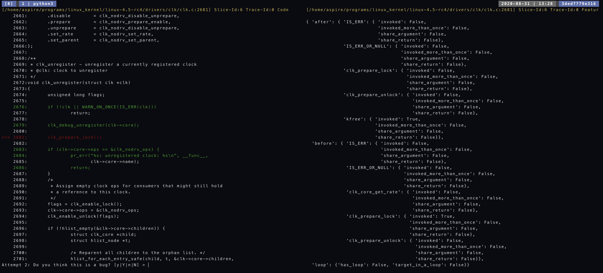
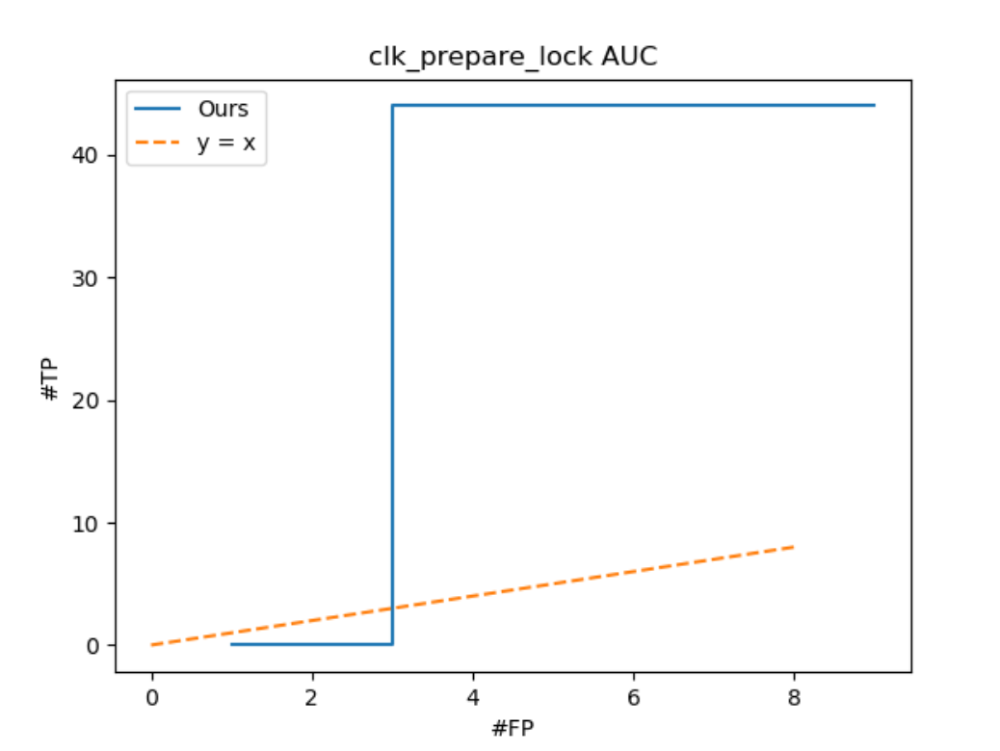

# Use our MISAPI tool to do experiment

There are 4 stages of using our `misapi` tool, and each of them can work fairly independently. They are "collect", "analyze", "database" and finally "learn". We are going to talk about these separately

## 0. Access server & server folder setup

Our server is setup inside of a docker and could be accessed using just username and password. You shall do

```
$ ssh -p 2021 aspire@ash04.seas.upenn.edu
```

With password

```
ai4code
```

After you are inside of the server, you shall do a `ls` to know what's going on. There are a few folders that are worth mentioning:

```
$ ls -l
total 0
drwxrwxr-x 12 aspire aspire 248 Aug 31 00:45 databases
drwxrwxr-x 10 aspire aspire 268 Jul 10 13:56 ll_analyzer
drwxrwxr-x  4 aspire aspire  54 Jul 15 13:47 programs
...
```

### 0.0 `databases` folder

This folder contains all the databases. To define database more properly, it's a unit of dataset in the context of using our tool. A database will contain all the programs and compiled byte codes, the analyzed results (slices, traces, and so on), and the final learning experiment results.

Now inside the `databases` folder I've been working on some linux kernel experiments and debian packages experiments, so you are seeing that I named them in a related manner. You can either jump in one of the databases or create one of your own, and we will talk about how to do this later.

### 0.1 `ll_analyzer` folder

This is the source code folder containing our tool. The entry point is exactly the file `misapi`. If you don't want to mess with the source code, you don't need to bother looking at this. Otherwise, the new analyzer core (implemented in Rust) is living inside the directory `/home/aspire/ll_analyzer/src/new_analyzer/core/`; The machine learning code is mainly inside `/home/aspire/ll_analyzer/src/learning/`.

### 0.2 `programs` folder

I use this folder to store any precompiled libraries, including Linux Kernel. I currently have two versions, `4.5-rc4` and `5.7-rc5`. You can find the compiled bc file at `/home/aspire/programs/linux_kernel/linux-4.5-rc4/vmlinux.bc` and `/home/aspire/programs/linux_kernel/linux-5.7-rc5/vmlinux.bc`

## 1. `collect` step

This step is mainly for us to collect the packages, compile them and make it analyzable. We can start from a few standpoints, and we'll talk about them in sequence. Note that one single database can contain multiple programs from different sources. So you can freely combine the steps below to construct your own database.

If you are working on one of the databases I already built, then very likely don't need to run any of the commands inside this step, because I've already collected the related programs.

### 1.0. Initializing

If you want to create a fresh database, you just create a new folder using `mkdir`, and then you

```
$ misapi init
```

To initialize the database.

### 1.1. Collecting pre-compiled packages

If you already have a `.bc` file ready, then this is going to be the quickest way of constructing the database. You just do

```
$ misapi collect PATH/TO/YOUR/BC/FILE.bc
```

As an example, to add the precompiled linux kernel into your database, you should do

```
$ misapi collect ~/programs/linux_kernel/linux-4.5-rc4/vmlinux.bc
```

### 1.2. Pulling and Auto-compiling Packages

For this, we now support two kinds of packages: Debian package & Git repositories. They share very similar steps, but the internal build steps are different.

Let's get started with defining a new `packages.json`. Create this file and edit it so that it looks like this:

``` json
[
  {
    "name": "openssl",
    "pkg_src": {
      "src_type": "github",
      "link": "https://github.com/openssl/openssl.git"
    }
  },
  {
    "name": "atftpd",
    "pkg_src": {
      "src_type": "debian",
      "link": "atftpd"
    }
  }
]
```

So this `packages.json` will contain a JSON array, each of which is a package in the form of JSON object. Each package object must contain a "name" field, used to identify the package and has to be unique. Then you provide "pkg_src" representing the source of the package. Now, for "src_type" you can either put `"github"` or `"debian"`. If you are pulling from a github source, then in the `"link"` field you should provide the full link to the repository; if you are pulling a Debian package, you just provide the name of that package in Debian package registry. In case you can't find a specific Debian package, feel free to use `sudo apt-get ...`  to direct the registries.

After you finish setting up your `packages.json`, you just need to say

```
$ misapi collect packages.json
```

and the tool will pull the packages & build it for you.

The internal build system is quite different for a git repository and Debian. For a git repository, there better be a `configure` file and a `makefile` inside, otherwise the auto-build system won't be able to do anything. In case the auto build fails, you might want to manual compile it separately and use the method in 1.1 to add the byte code to the database.

The Debian package build system internally directly uses Debian's build system, so it should be quite robust. Although sometimes it can't find an executable/library automatically or do `extract-bc`, which is extracting LLVM byte code, automatically. In such cases, you might want to step back to github package type or even manually compile.

## 2. `analyze` step

Now there comes a more interesting step which is actually using our analyzer (a combination of slicer, symbolic executor, and feature extractor) to analyze the LLVM byte code. Since we are analyzing APIs, you might want to prepare yourself with a specific API you want to analyze. You are also able to input a regex to match over a bunch of APIs. If you don't have any idea, you don't need to input an API target, but that will by default analyze all the functions presented inside a database (potentially containing multiple packages), so it might be getting very slow.

Say that you want to analyze a function called `malloc`, it's very simple

```
$ misapi analyze --include-fn malloc
```

If you want to analyze all the functions that end with a name `lock`, you use a regex expression:

```
$ misapi analyze --include-fn ".*lock" --regex
```

If you simply want to analyze all the functions inside the database, you just do

```
$ misapi analyze
```

but again, this will probably take a ton of time.

### 2.0. Get occurrences

It's sometimes useful to analyze the occurrence of library function across the whole database. You can type the following command to compute function occurrence (for all the bc-files inside the database).

```
$ misapi occurrence
```

After this, you should be able to query the occurrences

### 2.1. Other Flags

In this section we are going to talk about other useful flags when running the analyzer.

#### 2.1.1. `--slice-depth`

Slice depth represents the depth of the slice going upwards or downwards from the call-site. The larger this number, the larger will be the slice and the longer it might take to analyze.

You use it like this:

```
$ misapi analyze --include-fn malloc --slice-depth X
```

This argument has a default value of `1`, so from the call site, it will by default go one level up. As an example, consider the following program

``` C++
void a() { b(); }
void b() { c(); }
void c() { target(); }
```

Say `target` is our analysis target, and it's called by function `c`. If we have a slice depth of `1`, then the entry point of the slice will be `b`. The execution will go into `c` and reach the `target` function call.

If we have a slice depth of `0`, then the entry point will be `c` itself, and should largely shorten the execution time. So in case you know the "bug" you are looking for is kind of a local pattern, you should provide a `0` slice depth.

#### 2.1.2. `--entry-location`

You sometimes want to do a filtering step on slices to restrict the part of code you are analyzing. Then you can use the `--entry-location` flag.

As an example, if you only want to analyze the slices that are inside of the `drivers` folder inside Linux Kernel, you can use this flag

```
$ misapi analyze --include-fn clk_prepare_lock --entry-location "drivers"
```

This flag will do a string match on the location of the entry function. So very likely a function will have a location `/drivers/clk/clkdev.c`, then there's a match. Any function that does not contain `drivers` in their location will not be included.

#### 2.1.3. `--causality-dict-size`

We know that our causality features are provided by a dictionary. Basically what we do is, say we have our target function `target` we collect the occurrence of all other functions occurring around `target` call. For the sake of feature generation, we only pick a limited amount of functions out of all functions presented. And we do that by ranking occurrences. So certainly there are cases where one function wouldn't get included inside the causality dictionary. In such cases, you might want to increase this size.

The default value is `5`, you can change it to other value by doing

```
$ misapi analyze --include-fn malloc --causality-dict-size 10
```

It's worth noting that this won't increase the runtime. It might increase the disk space occupied, but we generally don't care about this.

### 2.2. Runtime

As we have our new implementation in Rust, along with a few optimizations, our execution is now very fast. An example run on `devm_kzalloc` function inside Linux Kernel only takes less than 3 minutes, whereas the old OCaml version can take up to an hour. We have multi processing enabled by default. You can turn it off by specifying flag `--serial` but we don't see any reason other than for debugging purpose.

The runtime is roughly divided into 4 parts:

1. Loading byte code
	- Sometimes take a lot of time
	- Loading Linux Kernel takes 40 seconds
2. Slicing
	- Should be fairly quick
3. Symbolic execution
	- Slow, will take the majority of the time running this tool
	- Will show progress bar when running
4. Feature extraction
	- Fairly quickly

### 2.3. Analysis Result

The results of the analysis is stored in the database inside JSON format. After the analysis you shall see a folder popping up in your database:

```
$ ls -l
total 0
drwxrwxr-x 6 aspire aspire 107 Aug 31 04:07 analysis # <--
drwxrwxr-x 3 aspire aspire  21 Jul  6 18:38 packages
```

Inside the `analysis` folder, you see

```
$ cd analysis
$ ls -l
total 4
drwxrwxr-x 4 aspire aspire  62 Aug 31 03:13 features
drwxrwxr-x 4 aspire aspire  62 Aug 31 01:20 slices
drwxrwxr-x 4 aspire aspire  50 Aug 31 01:20 traces
...
```

Pretty literally, slices are stored in the `slices` folder, traces are stored in the `traces` folder, and features are stored in `features` folder.

#### 2.1.1. Slice

A slice json has form

``` json
{
  "caller": "CALLER_NAME",
  "callee": "CALLEE_NAME",
  "entry": "ENTRY_NAME",
  "functions": [
    "FUNCTION_NAME_1",
    "FUNCTION_NAME_2",
    ...
  ],
  "instr": "/PATH/TO/INSTRUCTION/LOCATION.c:LINE:COLUMN"
}
```

Each slice will get a unique `slice_id` among its function and package bc file dataset. So the folder arranges like this:

```
/DATABASE_ROOT/analysis/slices/<function_name>/<package_bc_file>/<SLICE_ID>.json
```

This way, even when a same function is used in different packages, they will be grouped together under the `<function_name>` folder. The slice_id will start from 0 for each target function + package bc file, so in each of this kind of folder, you should see slice_id starting from 0 going all the way through. Roughly speaking, the number of slices corresponding to how often people use this API function inside their package.

#### 2.1.2. Traces

A trace json has form

``` json
{
  "instrs": [
    {
      "log": "INSTRUCTION_LOCATION",
      "sem": <Instruction semantics...>,
      "res": <Potentially some result for that instruction>
    }
    // ... OTHER INSTRUCTIONS
  ],
  "target_node": <TARGET_NODE_INDEX_IN_INSTRS>
}
```

The trace represents a sequence of instructions. In our case, we also add target node index into the trace so that people can identify the target call instruction.

Note that multiple trace will be generated from a single slice, so the directory towards a trace looks like this

```
/DATABASE_ROOT/analysis/traces/<function_name>/<package_bc_file>/<SLICE_ID>/<TRACE_ID>.json
```

We have a default of maximum 50 traces per slice, so you will probably see many folders have a maximum trace id of 49.

#### 2.1.3. Features

A features file looks like this

``` json
{
  "after":{
    "IS_ERR":{
      "invoked":false,
      "invoked_more_than_once":false,
      "share_argument":false,
      "share_return":false
    },
    ...
  },
  "before": {
    "kzalloc": {
      "invoked":false,
      "invoked_more_than_once":false,
      "share_argument":false,
      "share_return":false
    },
    ...
  },
  "ret": {
    "derefed": false,
    "returned": true,
    "indir_returned": false,
  },
  "ret.check": {
    "checked": true,
    "br_eq_zero": true,
    "br_neq_zero": false,
    "compared_with_zero": true,
    "compared_with_non_const": false,
  },
  "arg.0.pre": {
    "checked": true,
    "compared_with_zero": true,
    "arg_check_is_zero": false,
    "arg_check_not_zero": true,
    "is_constant": false,
    "is_global": true,
  },
  "arg.0.post": {
    "used": true,
    "used_in_call": false,
    "used_in_check": false,
    "derefed": true,
    "returned": false,
    "indir_returned": false,
  },
  ...
  "loop": {
    "has_loop": true,
    "target_in_a_loop": false
  }
}
```

Most of the features are true and false. So you can use this file to check if there's any hold inside the analyzer.

Each **trace** will correspond to exactly one **features json**, so they share similar file path

```
/DATABASE_ROOT/analysis/features/<function_name>/<package_bc_file>/<SLICE_ID>/<TRACE_ID>.json
```

In the following sections we will describe feature groups and the features inside each one of them

##### 2.1.3.1. Causality feature groups

There are two causality feature groups:

1. the functions called before target function
2. the functions called after target function

For each of these feature groups, we will run the extractor for two passes. The first pass will go over all the functions being called in relation to the target function, and construct a occurrence map: `Map<function_name, #occurrence>`. After that we will pick up the most `N` occurred functions to be inside our feature group. Then for the second pass we will generate actual features for those most occurred functions.

- `invoked`: The caused function is called (invoked) or not
- `invoked_more_than_once`: The caused function is called multiple times or not
- `share_argument`: Check if there's an instance of the caused function sharing argument with the target function. e.g.
  ``` C++
  mutex_lock(&lock); // <-- target
  mutex_unlock(&lock); // sharing the argument `&lock`
  ```
- `share_return`: Check if there's an instance of the caused function using the result of the target function call. e.g.
  ``` C++
  ptr = malloc(size); // <-- target
  free(ptr); // share the return value `ptr`
  ```

The above features will present for each of the function inside causality dictionary.

##### 2.1.3.2. Return value feature group

This feature group will be enabled when the return value is not `void`. It will contain the following features

- `derefed`: If the return value is dereferenced (i.e. used in store/load/getelementptr) later on
- `returned`: If the return value is directly returned at the end of the trace
- `indir_returned`: If the return value is indirectly returned. e.g. its being stored inside a larger array or struct, and that struct is returned

##### 2.1.3.3. Return value check feature group

This feature group is dedicated to the return value checks. It will be enabled when the return value is not `void`. It will contain the following features

- `checked`: if the return value is checked (i.e. used in icmp)
- `br_eq_zero`: if the branch being taken in this trace means the return value is equal to zero
- `br_neq_zero`: if the branch being taken in this trace means the return value is not equal to zero
- `compared_with_zero`: if the return value is compared with zero
- `compared_with_non_const`: if the return value is compared with non constant (other variable)

> Note: if the value is not compared with zero, then `br_eq_zero` and `br_neq_zero` will be both `false`

##### 2.1.3.4. Argument value pre-condition group

There will be one such group for every argument. It contains features for the argument pre-condition:

- `checked`: If the argument is checked prior to being passed to target function call
- `compared_with_zero`: If that check is compared with zero
- `arg_check_is_zero`: If that check branch assumes the argument is zero
- `arg_check_not_zero`: If that check branch assumes the argument is not a zero
- `is_constant`: Check if argument is a constant
- `is_global`: Check if argument is a global value

##### 2.1.3.5. Argument value post-condition group

There will be one such group for every argument. It contains features for the argument post-condition:

- `used`: If the argument is used later on
- `used_in_call`: If the argument is used inside a call
- `used_in_check`: If the argument is used inside a check (i.e. icmp)
- `derefed`: If the argument is being dereferenced (e.g. load/store/getelementptr)
- `returned`: If the argument is being returned directly
- `indir_returned`: If the argument is being returned indirectly, e.g. being stored inside some larger array or struct and that struct is returned.

##### 2.1.3.6. Loop feature group

This feature group will be enabled for every function, and it's related to loops inside the trace:

- `has_loop`: There's at least one loop inside the trace
- `target_in_a_loop`: The target function is called inside a loop body

## 3. Database operations

Since this is a database, we provide many queries for people to use, especially marking and inspecting data. This is still partly under construction, but it's also not so crucial, so let me skip this one for now.

## 4. Learning

To use active learning to learn correct usage from dataset, you shall do the following

```
$ misapi learn active clk_prepare_lock
```

This is invoking the learning module and using the "active learning" algorithm to learn the dataset for `clk_prepare_lock`. The dataset for this function will contain traces drawn from all packages that uses this function. Say we are analyzing the function `malloc`, it will then include the traces for `malloc` from every package that's inside of this database.

If things goes well, after learning algorithm initialization, you shall see a screen with left side being the code snippet around the target function call, as well as a feature json on the right hand side.

### 4.1. Feedback

You should combine the information on both sides to give your final feedback -- is this API-call a "bug" or "not". The way you provide feedback should be

- pressing `y` for "yes, this trace contains a bug", or
- pressing `n` for "no, this trace does not contain a bug", or
- pressing `Y` for "YES, THIS WHOLE SLICE IS BUGGY", or
- pressing `N` for "NO, THIS ENTIRE SLICE IS JUST NORMAL".

You don't have to walk all the way towards the end of the dataset, and you can stop at any time by pressing `q`. That will generate an experiment report (elaborated in $4.5).

### 4.2. User interface



In the above example, the trace is marked in green. You can clearly see that the trace goes inside of the if branch and returned directly. This is a sign of `clk_prepare_unlock` not being called. On the right hand side, you will also see that `"after"."clk_prepare_unlock"."invoked"` is `False`, this confirms with our observation on the left hand side. Therefore, the answer to this query should be `y`, yes this trace contains a bug.

### 4.2.1. Code frame

In case the code panel is not showing enough context, you can either call with an option `--padding` like this:

```
$ misapi learn active clk_prepare_lock --padding 40
```

This will show 40 lines above and below the target function call, so roughly 80 lines of code will be shown. But keep in mind that the screen size is limited, so you don't want to boost this option too much. In case you need more comprehand view of the code, you can refer to the file directory on the top of the screen, and go to the source code directly.

### 4.2.2. Attempt number

On the bottom left corner you will see the number of the current attempt. Ideally the earlier you encounter a bug the better. In this case, it is encountered at the third time (we count from 0).

### 4.2.3. Slice ID and trace ID

You can use slice id and trace id to refer back to the analysis result. You should do this when you think the analysis result is malformed (e.g. features does not represent the trace or trace path is unsatisfiable).

### 4.3. Feedback examples

Consider the following scenario:

``` C++
ptr = malloc(...); // <-- target function call

// There's no check for ptr

ptr->field = value; // <-- target call result being dereferenced
```

In this example slice, **every** trace going through the target function call will not be checked. Therefore the feedback "Yes, it is a bug" applies to all the traces. In this case, you should give feedback `Y` so that you don't manually hit `y` for a lot of times.

On the other hand, in the following scenario:

``` C++
mutex_lock(&lock);    // A, <-- target function call
if (some_criteria) {  // B
  return;             // C
}                     // D
mutex_unlock(&lock);  // E
// ...
```

There are two traces going through target function call: `ABC` and `ABE...`. In this case, only the `ABC` trace is problematic -- it forgets to unlock the lock. So suppose you get a query about trace `ABC`, you should answer with `y`.

### 4.5. Experiment Results

Each learning call to misapi

```
$ misapi learn active clk_prepare_lock
```

will create an "experiment". This experiment will be stored in a folder that's named after function name and time stamp

```
DATABASE_ROOT/learning/<TIME_STAMP>-<FUNCTION_NAME>/
```

Let's go to this directory and see what's inside

```
$ cd learning/<TIME_STAMP>-<FUNCTION_NAME>/
$ ls -l
total 616
-rw-rw-r-- 1 aspire aspire   4209 Aug 31 15:27 alarms.csv
-rw-rw-r-- 1 aspire aspire  15644 Aug 31 15:27 auc.png
-rw-rw-r-- 1 aspire aspire    123 Aug 31 15:27 log.txt
-rw-rw-r-- 1 aspire aspire   1165 Aug 31 15:27 match.csv
...
```

Let's talk about these one by one:

#### 4.5.1. `alarms.csv`

This is a table file containing all the alarms being generated by the active learning algorithm. It will look like this

``` csv
bc,slice_id,trace_id,score,alarms
vmlinux.bc,6,0,0.0791447982693563,"[]"
vmlinux.bc,6,1,0.0791447982693563,"[]"
vmlinux.bc,6,11,0.0791447982693563,"[]"
vmlinux.bc,6,12,0.0791447982693563,"[]"
vmlinux.bc,6,20,0.0791447982693563,"[]"
vmlinux.bc,9,0,0.0791447982693563,"[]"
vmlinux.bc,9,2,0.0791447982693563,"[]"
vmlinux.bc,9,7,0.0791447982693563,"[]"
vmlinux.bc,9,12,0.0791447982693563,"[]"
vmlinux.bc,9,30,0.0791447982693563,"[]"
vmlinux.bc,8,0,0.0791447982693563,"[]"
vmlinux.bc,8,1,0.0791447982693563,"[]"
vmlinux.bc,8,7,0.0791447982693563,"[]"
vmlinux.bc,8,16,0.0791447982693563,"[]"
...
```

The score corresponds to how likely is this trace a bug, and it will show the LLVM byte code file, the `slice_id` and the `trace_id` to help you pinpoint the alarm trace.

Note that the traces where you give "YES IT IS A BUG" feedback will naturally get a very high score and rank high up in the list. But this will also provide the other datapoints that it predicts to be having tendency to be a bug -- in other word, it will contain datapoints that you have not visited yet.

#### 4.5.2. `auc.png`

This is a visualization of AUC (area under curve). It should look something like this:



On this graph, we gave roughly 50 feedbacks to the active learning `clk_prepare_lock` experiment. It shows
that the first two attempt results in "FP" (false positive) and it starts to capture the "TP" (true bug) -- going straight up. Finally it settles without finding bug anymore.

This graph serves as a good visualization to show how well this tool is performing. Ideally, it should start shooting upwards as early as possible, which is what's happening in this example.

#### 4.5.3. `match.csv`

This is a list of datapoints similar to `alarms.csv`, but it will only contain the datapoint that you clearly provided "True Bug" feedback when doing active learning.

Along with the basic informations, it will also show the number of attempt that this datapoint is presented to you. As always, the smaller these numbers are, the better the model is performing.

``` csv
bc,slice_id,trace_id,score,alarms,attempt
vmlinux.bc,6,0,0,"[]",2
vmlinux.bc,6,1,0,"[]",3
vmlinux.bc,6,11,0,"[]",4
vmlinux.bc,6,12,0,"[]",5
vmlinux.bc,6,20,0,"[]",6
vmlinux.bc,9,0,0,"[]",7
vmlinux.bc,9,2,0,"[]",8
vmlinux.bc,9,7,0,"[]",9
vmlinux.bc,9,12,0,"[]",10
vmlinux.bc,9,30,0,"[]",11
vmlinux.bc,8,0,0,"[]",12
vmlinux.bc,8,1,0,"[]",13
```

### 4.6. Automatic Evaluations

IN PROGRESS

#### 4.6.1. Datapoint Labeling

IN PROGRESS

#### 4.6.1. Evaluate with automatic feedback

IN PROGRESS
