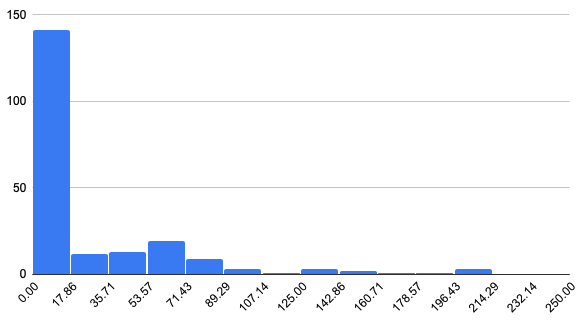

# OpenSSL - CRYPTO_zalloc

This document documents the process of doing experiment on OpenSSL's `CRYPTO_zalloc` function.

## Stats

- Number of slices: 98
- Number of traces: 209
- Average Trace per Slice: 2.13
- Average Statement per Trace: 30.81

## How to compile

``` bash
$ cd /home/liby99/projects/unsup_laboratory/
$ git clone https://github.com/openssl/openssl
$ cd openssl
$ mkdir llvm_objs
$ set -Ux CC wllvm
$ set -Ux CXX wllvm++
$ set -Ux CFLAGS "-O1 -g"
$ ../config
$ make -j32
$ extract-bc libssl.so.3
```

Side notes:

1. We use flag `"-O1 -g"`.
  - `O1` is to disable optimization
  - `-g` enabling debug information
2. There are two libraries being compiled: `libssl.so.3` and `libcrypto.so.3`. We
  wanted to use `libcrypto` since it's more direct. But unfortunately our code is
  stuck on that library. We can perform good in `libssl` though. This is worth
  investigating

TODO:

1. Find an earlier version of `openssl` from Github so that Kihong's posted bug
  still exhibits in the code.

## How to run

``` bash
$ cd /home/liby99/projects/ll_analyzer
$ ./llextractor -n 5 -fn CRYPTO_zalloc -outdir data/libssl_crypto_zalloc_n_5 ../unsup_laboratory/openssl/llvm_objs/libssl.so.3.bc
```

Output:

```
Slicing complete in 0.559377 sec
98/98 slices processing
Symbolic Execution complete in 154.589123 sec
```

The output currently resides in

```
fir03:/home/liby99/projects/ll_analyzer/data/libssl_crypto_zalloc_n_5
```

Side notes:

1. We are targeting to find the `OPENSSL_zalloc` function. But it's actually a macro
  which is using the real function `CRYPTO_zalloc`. Hence we specify we only care
  about this function in our extractor argument: `-fn CRYPTO_zalloc`
2. In this case, we use slicing depth 5 around the function, by specifying argument
  `-n 5`

## Studies

### Trace lengths

```
$ cd /home/liby99/projects/ll_analyzer/experiments/libssl_crypto_zalloc/
$ node ./analyze_average_trace_length.js
```

This will give

```
Average length of trace: 30.8133971291866
```

and other information stored in [`trace_lengths.json`](trace_lengths.json).

Distribution of trace lengths:



Notice that most are short but still there are longer ones with 200+ statements.

### `icmp` after `zalloc`

After running the result, we run the following analyze script to find how many of them has `icmp` after `zalloc`

``` bash
$ cd /home/liby99/projects/ll_analyzer/experiments/libssl_crypto_zalloc/
$ node ./analyze.js
```

This script then spits out,

```
Total number of traces: 209
The number of traces with "Icmp" after "zalloc": 206
```

At the same time it will output two files in the same directory, namely,

[`traces_with_icmp_after_zalloc.json`](traces_with_icmp_after_zalloc.json)

and

[`traces_without.json`](traces_without.json)

Since we know that the majority of `zalloc` is followed by `icmp`, we will go to see the traces without, as listed in [`traces_without.json`](traces_without.json).

It has content

``` json
[
  {"file":"CRYPTO_zalloc-14-dugraph.json","index":"0"},
  {"file":"CRYPTO_zalloc-15-dugraph.json","index":"0"},
  {"file":"CRYPTO_zalloc-16-dugraph.json","index":"0"}
]
```

Going into these three traces we can pinpoint the positions of the function call of `zalloc` in the actual code. As a result, slice `14`, `15`, and `16` are all centered around a function called `SSL_CONF_CTX_new`.

``` c
SSL_CONF_CTX *SSL_CONF_CTX_new(void)
{
    SSL_CONF_CTX *ret = OPENSSL_zalloc(sizeof(*ret));

    return ret;
}
```

Just as we look at it, it seems that this function call `SSL_CONF_CTX_new` **ALWAYS** has compare directly after
it. This remains a mystery why our tool doesn't pick it up.

Detail information [here](https://github.com/openssl/openssl/blob/master/ssl/ssl_mcnf.c#L47):

TODO:
1. Figure out why don't we have `icmp` followed by this in our dataset?
2. Still print out the entry point of our symbolic execution, otherwise when the
  traces are exactly identical, we are unable to pinpoint the whole trace.

As a resulting observation, **ALL** of the `zalloc`s are followed by `icmp` in OpenSSL.